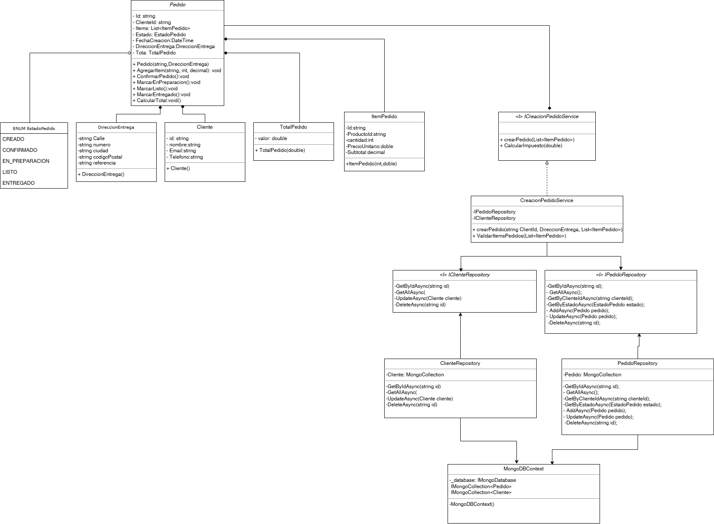

# Hola profe,

Este es nuestro trabajo de la primera entrega del micro servicio de pedidos. Utilizamos .net core 8 y Mongo Atlas. Dejamos un dockerfile sencillo para que pueda probar el microservicio si lo desea. la db la tenemos full expuesta 0.0.0.0/0 \:v

Esquema básico uml, sin agregar todas las clases 


## Cómo Ejecutar el Proyecto

1. **ir o pararse en la ruta donde se encuentra en dockerfile**
2. **Construir la imagen Docker**

   ```sh
   docker build -t pedidos-service .
   ```

3. **Ejecutar el contenedor**

   ```sh
   docker run -p 8080:8080 pedidos-service
   ```

4. **Acceder a la API**

   - ahora la API esta disponible en: `http://localhost:8080`
   - La documentación Swagger esta disponible en: `http://localhost:8080/swagger`

## Pruebas de Endpoints

### GET

- Obtener cliente por ID: da5004fb-191c-4f75-88f2-e9ec77afa6f0

- Obtener pedido por ID: a0e3c6c5-e337-44cf-9266-973e74f0eaf8

- Obtener pedidos por estado: CREADO

### POST

Los endpoints POST están documentados en Swagger. 

cualquier novedad quedamos super atentos y nos puede escribir via TEAMS, 

Saludos!!


John Estiven Restrepo Marin 

Carlos Alejandro Zuluaga Lopez

Juan Andres Loaiza Acosta
